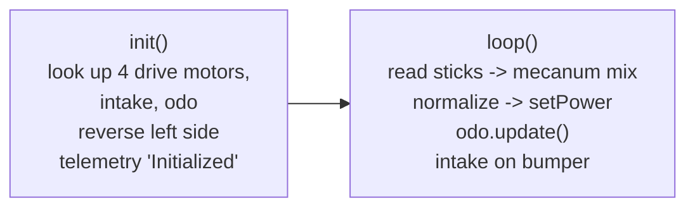

# DriveTest — 8lb Fish Mecanum Teleop

`DriveTest.java` is the `@TeleOp` drive-check OpMode for the **8lb Fish** robot (the sibling of
`AutoTest.java`, which shares the same hardware names). It is deliberately minimal: one gamepad
drives a 4-wheel mecanum chassis, one bumper reverses an intake motor, and the Pinpoint odometry
pod is read every loop.

- **Driver Station entry:** `"8lb Fish Drive Test"`, group `"OpMode"`
- **Style:** iterative `OpMode` (`init()` / `loop()`), *not* `LinearOpMode`
- **Not** `@Disabled` — it shows up in the DS menu as-is.

> The file was forked from the SDK's `BasicOpMode_Linear` sample, so the header comment still
> describes "a basic Tank Drive Teleop for a two wheeled robot" and the FIRST BSD notice. Ignore
> that block — it does not describe this code.

---

## Hardware

| Field | `hardwareMap` name | Type | Notes |
|-------|--------------------|------|-------|
| `frontRight` | `"rightFront"` | `DcMotor` | default direction |
| `frontLeft` | `"leftFront"` | `DcMotor` | set to `REVERSE` |
| `backRight` | `"rightBack"` | `DcMotor` | default direction |
| `backLeft` | `"leftBack"` | `DcMotor` | set to `REVERSE` |
| `intake` | `"intake"` | `DcMotorEx` | run open-loop via `setPower` only |
| `odo` | `"odo"` | `GoBildaPinpointDriver` | heading + position read each loop |
| `rightGecko` | `"rightGecko"` | `CRServo` | **commented out** (declaration, lookup, and `REVERSE`) |

> ⚠️ **Drive directions differ from the ChargedCreeper convention** documented in `CLAUDE.md`
> (where only `rightBack` is reversed). This OpMode reverses **both left-side motors**, which is
> the 8lb Fish wiring. Don't copy directions between the two robots' OpModes.

The many vision/IMU/servo imports at the top (`VisionPortal`, `AprilTagProcessor`, `IMU`,
`Servo`, `ElapsedTime`, `Size`, `WebcamName`, …) are leftovers from the fork — nothing in the
file uses them.

---

## Lifecycle



### `init()`
Grabs the six hardware devices, reverses `frontLeft` / `backLeft`, and posts
`Status: Initialized` (twice — the second `addData`/`update` pair is a duplicate).

**All Pinpoint configuration is commented out**: `setOffsets(-84, -168, MM)`,
`setEncoderResolution(goBILDA_4_BAR_POD)`, `setEncoderDirections(REVERSED, FORWARD)`, and
`resetPosAndIMU()`, plus the offset/version/yaw-scalar telemetry. The pod is therefore read in
`loop()` with whatever configuration is left on the device from a previous OpMode — headings and
positions are **not** trustworthy in this OpMode. If you need real odometry here, uncomment that
block (the constants are the team-tuned values from `CLAUDE.md`).

---

## Controls (gamepad 1)

| Input | Effect |
|-------|--------|
| Left stick Y | `drive` (forward/back; negated so stick-up is positive) |
| Left stick X | `strafe` (right positive) |
| Right stick X | `turn`, scaled to **0.75×** to soften rotation |
| Right bumper | `intake.setPower(-1)` while held |
| *(nothing held)* | `intake.setPower(+1)` — see note below |

> ⚠️ The intake is **never off**. The `else` branch drives it at full `+1`, so the motor spins
> continuously from the moment the OpMode starts and the bumper only flips it to `-1`. If the
> intent was "idle stopped, bumper runs it," the `else` should be `setPower(0)`.

---

## `loop()` — mecanum mixing

Standard mixer, matching the formula in `CLAUDE.md` (with the 0.75 turn scale applied):

```
speeds[0] = frontLeft  = drive + strafe + 0.75*turn
speeds[1] = frontRight = drive - strafe - 0.75*turn
speeds[2] = backLeft   = drive - strafe + 0.75*turn
speeds[3] = backRight  = drive + strafe - 0.75*turn
```

Then: find the greatest **magnitude** across the four; if it exceeds `1`, divide all four by it
(preserving the ratio between wheels instead of clipping). Powers are applied in the order
`frontLeft, frontRight, backLeft, backRight` — note this is *not* the array's declaration order
matching the field names, so keep the index↔motor mapping in mind when editing.

After the motors, `odo.update()` runs and `Pose2D pos = odo.getPosition()` is read.

### Field-relative block (dead code)

```java
double theta = Math.atan2(drive, strafe);
double r     = Math.hypot(strafe, drive);
theta = AngleUnit.normalizeDegrees(theta - odo.getHeading(AngleUnit.RADIANS));
double newDrive  = r * Math.sin(theta);
double newStrafe = r * Math.cos(theta);
```

`newDrive` / `newStrafe` are computed and **never used** — the mixer uses the raw `drive` /
`strafe`, so driving is robot-relative. The comment in the file says as much ("not in use
currently"). Two things to fix before enabling it:

1. **Unit mismatch** — `atan2` and `getHeading(RADIANS)` both produce radians, but the result is
   passed to `normalizeDegrees(...)`. It should be `normalizeRadians` (or work in degrees
   throughout).
2. **Heading is unconfigured** — see the commented-out `resetPosAndIMU()` above; there is no
   zeroed reference heading.

Note also that `odo.getHeading(...)` is still called every loop even though its result is
discarded, so the I2C read cost is paid regardless.

---

## Things to watch

- **No telemetry in `loop()`.** `telemetry.update()` is called with no preceding `addData`, so the
  DS shows nothing while driving. `pos` is read but never displayed — adding
  `telemetry.addData("Pose", pos.getX(DistanceUnit.MM) + ", " + ...)` is the obvious next step for
  a drive test.
- **Intake always powered** (see controls table).
- **Pinpoint left unconfigured** — any position/heading use is unreliable until the commented
  block is restored.
- **Left-side reversal is 8lb-Fish-specific** — cross-check wiring before reusing this file for
  ChargedCreeper.
- **`intake` is typed `DcMotorEx`** but only `setPower` is used; `DcMotor` would suffice unless
  velocity control is added later.
