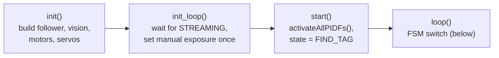
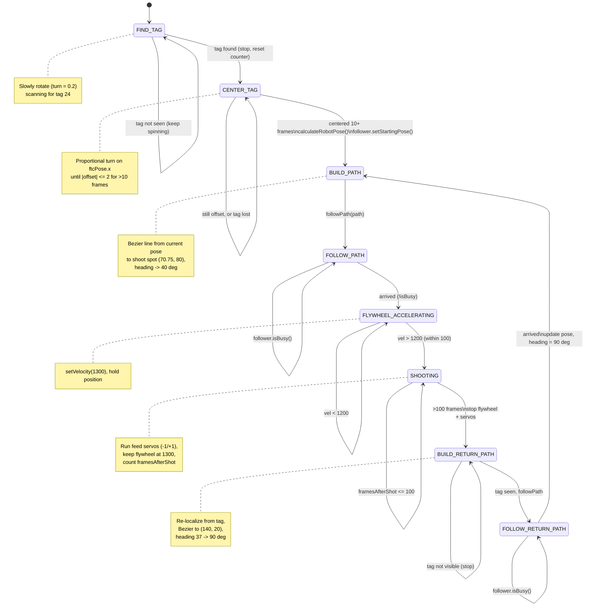
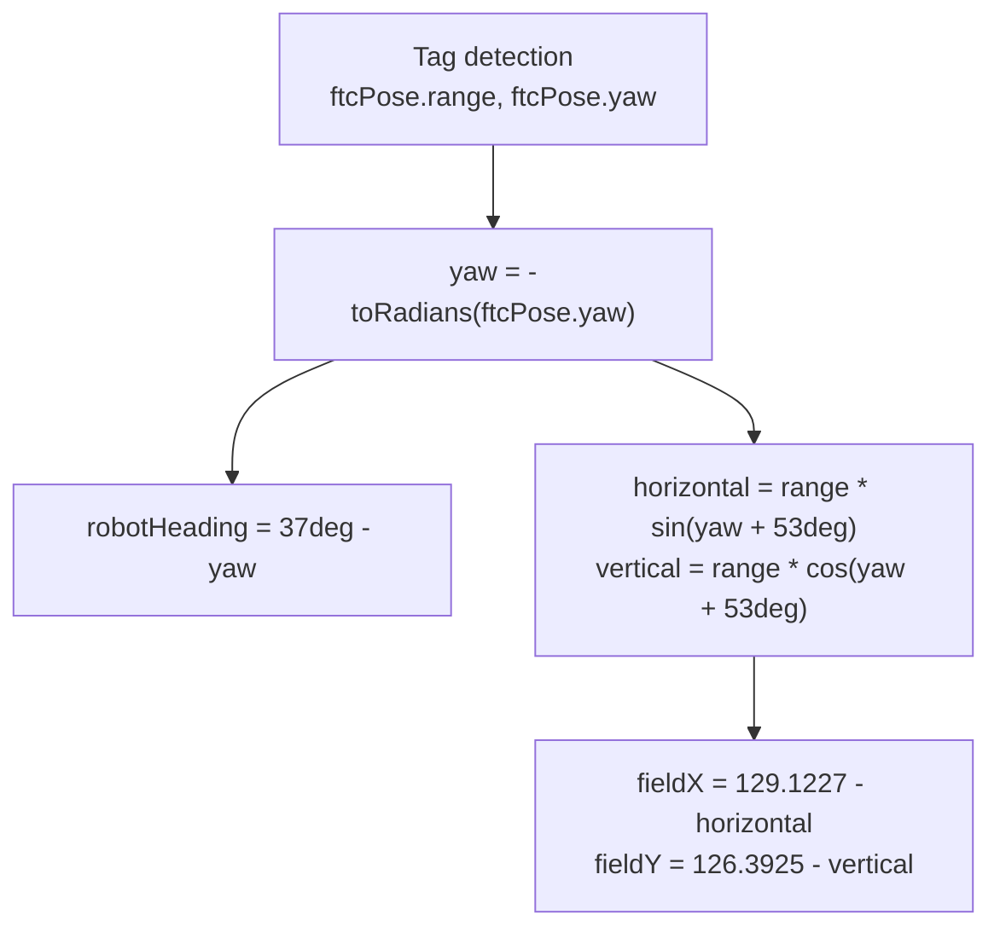

# AutoShootV1 — Autonomous AprilTag-Aligned Shooter

`AutoShootV1.java` is an `@Autonomous` OpMode for the ChargedCreeper robot. It runs a
vision-driven, **finite-state machine** that:

1. Finds a specific AprilTag with the webcam,
2. rotates to center on it,
3. localizes the robot on the field from the tag's pose,
4. drives (via Pedro Pathing) to a fixed shooting spot,
5. spins up the flywheel and fires using the intake servos,
6. drives back out, then loops to shoot again.

Unlike the team's other autos, this one extends the **iterative `OpMode`**
(`init()` / `init_loop()` / `start()` / `loop()`), not `LinearOpMode`. All behavior lives
inside the `loop()` `switch` over the `State` enum, so the FSM advances one step per loop tick.

---

## Hardware & key fields

| Field | `hardwareMap` name | Type | Purpose |
|-------|--------------------|------|---------|
| `frontLeftDrive` | `"leftFront"` | `DcMotor` | Mecanum drive (set to `REVERSE`) |
| `frontRightDrive` | `"rightFront"` | `DcMotor` | Mecanum drive |
| `backLeftDrive` | `"leftBack"` | `DcMotor` | Mecanum drive |
| `backRightDrive` | `"rightBack"` | `DcMotor` | Mecanum drive |
| `flywheel` | `"flywheel"` | `DcMotorEx` | Shooter wheel (velocity-controlled, `RUN_USING_ENCODER`) |
| `leftServo` / `rightServo` | `"leftServo"` / `"rightServo"` | `CRServo` | Intake/feed servos, run mirrored (`-1` / `+1`) |
| webcam | `"NeverGonnaGiveYouUp"` | `WebcamName` | AprilTag camera (640×480, YUY2) |
| `follower` | — | Pedro `Follower` | Path follower built from `Constants.createFollower(...)` |

> ⚠️ Note the drive-direction convention here **differs** from the rest of the codebase:
> this OpMode reverses `frontLeftDrive`, whereas `OLD_BasicOpMode_Linear` / `OLD_AutoSquare_Linear`
> reverse `rightBack`. Keep this in mind when copying code between them.

### Important constants
- `DESIRED_TAG_ID = 24` — only the tag named `"RED"` (id 24) is tracked.
- `desiredFlywheelVel = 1300` — target flywheel velocity (encoder ticks/sec); fire begins once
  velocity is within `100` of target.
- AprilTag library registers ids `6` (FIH), `24` (RED), `20` (BLUE), family `TAG_36h11`.
- Lens intrinsics `(243, 243, 320, 240)`; manual exposure `6 ms` / gain `50`.

---

## Lifecycle

---

## State machine (`loop()`)

> The machine **never terminates on its own**: after the return path it jumps back to
> `BUILD_PATH`, so it repeats the drive-to-spot → shoot → drive-back cycle until the
> autonomous period ends or the OpMode is stopped.

---

## State-by-state detail

- **`FIND_TAG`** — Calls `findDesiredTag()`. If nothing is found, rotates in place at `turn = 0.2`
  to sweep the field. On finding tag 24, stops and moves to `CENTER_TAG`.

- **`CENTER_TAG`** — Reads `desiredTag.ftcPose.x` (horizontal offset). Applies a proportional
  turn `clamp(offset * 0.03, ±0.25)` until the offset is within `2.0` inches. It must stay
  centered for **>10 consecutive frames** before localizing via `calculateRobotPose()`, seeding
  the follower's starting pose, and advancing. If the tag is lost mid-centering, it just stops.

- **`BUILD_PATH`** — Constructs a `BezierLine` Path from the computed `(fieldX, fieldY)` to the
  shoot position `(70.75, 80)`, with linear heading interpolation from `robotHeading` to `40°`,
  hands it to the follower, and advances.

- **`FOLLOW_PATH`** — Pumps `follower.update()` each tick; when `!follower.isBusy()` (path done),
  stops and goes to flywheel spin-up.

- **`FLYWHEEL_ACCELERATING`** — Commands flywheel to `1300` and waits until measured velocity
  exceeds `desiredFlywheelVel - 100` (i.e. `> 1200`) before shooting.

- **`SHOOTING`** — Keeps the flywheel at speed and runs the feed servos (`leftServo = -1`,
  `rightServo = +1`) for `>100` loop frames, then stops flywheel + servos and moves to the return path.

- **`BUILD_RETURN_PATH`** — Re-acquires the tag, re-localizes, builds a Bezier to `(140, 20)`
  with heading `37° → 90°`. If the tag isn't visible, it waits (stopped).

- **`FOLLOW_RETURN_PATH`** — Follows the return path; on arrival, reads the follower's pose,
  forces `robotHeading = 90°`, and loops back to `BUILD_PATH`.

---

## Helper methods

| Method | Role |
|--------|------|
| `moveRobot(drive, strafe, turn)` | Mecanum mixer: computes 4 wheel powers, normalizes by max>1, sets motor powers. |
| `stopDrive()` | `moveRobot(0,0,0)` — full stop. |
| `initAprilTag()` | Builds the AprilTag library/processor and `VisionPortal` (webcam, resolution, stream format, decimation). |
| `setManualExposure(ms, gain)` | Switches camera to manual exposure/gain — called once when the camera reaches `STREAMING`. |
| `findDesiredTag()` | Scans current detections, returns the one with `id == 24` (and non-null metadata), else `null`. |
| `calculateRobotPose()` | Trig conversion from the tag's `range`/`yaw` to field `(fieldX, fieldY)` and `robotHeading`, relative to the known tag field position `(129.12, 126.39)`. |

### `calculateRobotPose()` geometry

The `37°` / `53°` constants encode the tag's mounting angle on the field (they sum to 90°),
and `(129.1227, 126.3925)` is the tag's known field coordinate. The robot pose is derived by
subtracting the measured offset from that anchor.

---

## Things to watch / known rough edges

- **Frame-count timing is loop-rate dependent.** `centeringFrames > 10` and
  `framesAfterShot > 100` are counted in loop iterations, not time — behavior will shift if the
  loop speed changes (e.g. heavier vision processing).
- **No timeout / no graceful end.** The FSM loops forever back to `BUILD_PATH`; there is no
  exit state and no overall autonomous timer guard inside the OpMode.
- **`BUILD_RETURN_PATH` can stall** if the tag is never re-acquired — it stays put indefinitely.
- **Drive direction differs from team convention** (front-left reversed here vs. right-back
  elsewhere) — confirm against the on-robot wiring before reusing.